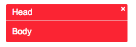

## Message js

#### Install
 
    npm install message-js    
    var Message = require('message-js');

if not using browerify/webpack simply copy message.js and message.css.

See the example in `example` folder.

#### Usage

```javascript
var message = Message(); // returns the same message obj every time.

 // use this to create new  message each time
message.create({
    _class: 'message--error',
    header: 'Error',
    body: 'Something bad happened.',
}).open();
```


#### Html generated

```html
<div class="message is-active">
    <div class="message__header"></div>
    <div class="message__close">X</div>
    <div class="message__body"></div>
</div>
```

#### Css 
Copy the css from message.css. `is-active` class is appled on open.


#### Close
```javascript
message.close(); // close immediately
message.close(2000); // to close after 2000ms
```


